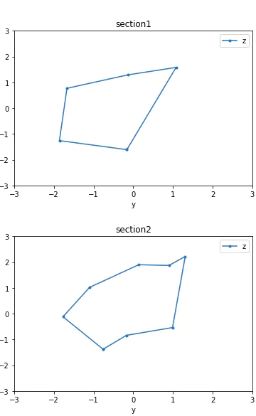
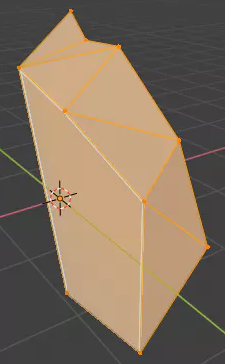
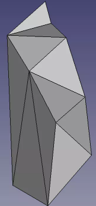

## Create Loft(blend) feature
Loft function (function to connect multiple sections) was created by combining Blender and FreeCAD

- 2sections (Definition pandas dataframe) 

- Create Loft Polygon by Blender

- Convert CAD Solid using by FreeCAD

